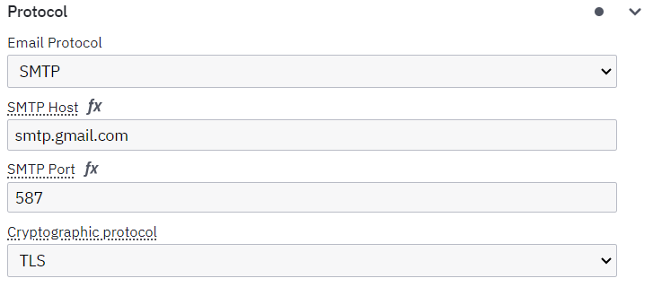
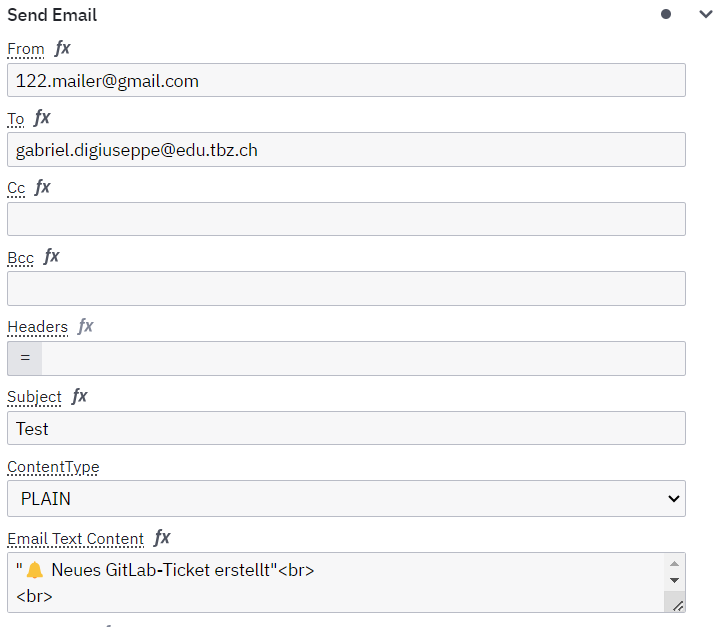

# Camunda Prozess: GitHub Issue-Erstellung mit E-Mail-Benachrichtigung

## 📌 Ziel

Dieses Projekt zeigt einen automatisierten Workflow mit Camunda 8, bei dem:

1. Ein Nutzer ein Online-Formular ausfüllt.
2. Nach Absenden wird automatisch eine E-Mail an vordefinierte Empfänger gesendet.
3. Zusätzlich wird über die GitHub API ein Issue im entsprechenden Repository erstellt.

## dc☁️ Architektur

 Gehostet in einer AWS EC2 Instanz

- Bereitgestellt mit Docker
- Camunda läuft als Container mit:
  - Web Modeler
  - Tasklist
  - Connectors (REST & Mail)

## 📦 Komponenten

- Camunda 8 (Docker-basiert) – BPMN Engine

- REST Connector – zum Erstellen von GitHub-Issues

- Mail Connector – für E-Mail-Versand via Gmail SMTP


## 📂 Struktur
```
├── docker-compose.yml            # Startet Camunda & benötigte Services
├── process/
│   └── issue_creation.bpmn       # BPMN-Prozess mit Formular, Mail- & REST-Aufruf
├── forms/
│   └── bug_report.form           # Camunda Form für Nutzereingabe
└── README.md                     # Diese Datei
```
## ⚙️ Konfiguration

### GitHub

- Token erstellen unter: https://github.com/settings/tokens

- Scopes: mindestens repo

- REST Connector-Einstellungen:

    - URL: https://api.github.com/repos/<owner>/<repo>/issues

    - Auth: Bearer

    - Token: <DEIN_PERSONAL_ACCESS_TOKEN>

Header:
```
{
  "Accept": "application/vnd.github+json",
  "Authorization": "Bearer <DEIN_PERSONAL_ACCESS_TOKEN>",
  "Content-Type": "application/json"
}
```
### SMTP Konfigurationen

Da Gabriel in einem Früheren Modul ein Test Gmail account erstellt hat und 2FA eingerichtet hat, kann er auf diesem Account App-Passwörter verwenden

Diese APp-Passworts erlauben ihm mit einem Secret, Benutzername und Service, den Free SMTP Server von Google zu verwenden.

Dafür brauchen wir in CAmunda ein Send Email BLock- und fügen dort die Credentials, also Passwort, Secret und Benutzer in das Protocol Feld ein.


Dannach Haben wir noch die Grundsätzlichen Sachen noch einfügen, wie Titel usw.

Und dann ist dieser Mail-Connection schon funktionstüchtig

- Gmail App-Passwort – für Authentifizierung beim Mailversand

- GitHub Personal Access Token – zum Erstellen von Issues

### ▶️ Ablauf

Nutzer ruft den Prozess über die Camunda Tasklist oder ein Frontend auf.

Formular wird angezeigt und ausgefüllt.

Nach dem Absenden des Formulars wird das an den GithubBlock weitergesendet, und der erstellt mit der API ein Github Issue im Github Repository.

Nach dem das Github Issue erstellt worden wurde, wird es weitergesendet, und es wird die Art von Issue aus dem Form gelesen, und bei einer Verzweigung entschieden, an wer es weiter gesendet wird.

Nachdem die Mail erstellt wurde, ist der Prozess fertig.

wird ein GitHub-Issue mit denselben Daten im angegebenen Repository erstellt.

🛠️ Anpassen

Empfängeradresse: Im Mail Connector konfigurieren.

GitHub-Repo/Labels: Im REST Connector anpassen.

Formularfelder: In der .form Datei erweitern.

Mail-Text & Betreff: Direkt im Connector definieren.

## Probleme
Ursprünglich war geplant, mit Zeebe Python Workers einen externen Worker direkt auf der Camunda EC2-Instanz zu betreiben. Ziel war es, Aufgaben aus einem Camunda-Prozess dynamisch zu verarbeiten – in unserem Fall das automatische Versenden von E-Mails.

### Einrichtung der Umgebung
Dazu wurde auf der EC2-Instanz zunächst Python 3 installiert. Anschließend wurde eine virtuelle Python-Umgebung erstellt, um projektabhängige Pakete isoliert verwalten zu können.
Nach einer kurzen Recherche installierten wir alle benötigten Python-Bibliotheken mit pip, unter anderem:

- pyzeebe – zur Verbindung mit dem Zeebe-Task-Handler
- smtplib bzw. email.message – für das Versenden von E-Mails via SMTP
- python-dotenv – zur sicheren Speicherung von Zugangsdaten in .env-Dateien

### Ziel und Funktionsweise
Der Worker sollte sich mit der Camunda-Plattform verbinden und dort auf Service Tasks mit definiertem Typ warten. Sobald ein solcher Task in einem Prozess erreicht wird, legt Camunda (über Zeebe) einen Auftrag in eine Queue.

Der Zeebe Worker läuft kontinuierlich im Hintergrund und idled, bis ein neuer Auftrag eingeht. Sobald ein passender Task erkannt wird, übernimmt der Worker den Auftrag automatisch, liest die übergebenen Variablen (z. B. Empfängeradresse, Betreff, Nachrichtentext), und verarbeitet diese mit Python-Logik.

In unserem konkreten Fall sollte der Worker anschließend eine E-Mail über den SMTP-Server von Gmail verschicken. Dafür wurde ein Gmail-Konto mit App-Passwort eingerichtet, da normale Logins mit Benutzernamen und Passwort durch Googles Sicherheitsrichtlinien blockiert werden.

### Herausforderungen
Die Einrichtung der Verbindung zwischen Camunda und dem Python-Worker war nicht trivial, da die Konfiguration von Zeebe, Ports, Firewalls und Authentifizierung korrekt abgestimmt sein muss.

Auch das Zusammenspiel zwischen Camunda-Variablen und dem Python-Code erforderte präzises Mapping.

Die größte Schwierigkeit war allerdings die stabile Ausführung des E-Mail-Versands mit externen Credentials über einen Drittanbieter wie Google – insbesondere mit Zeitouts, Authentifizierungsproblemen oder unzureichender Logging-Unterstützung bei Fehlern.